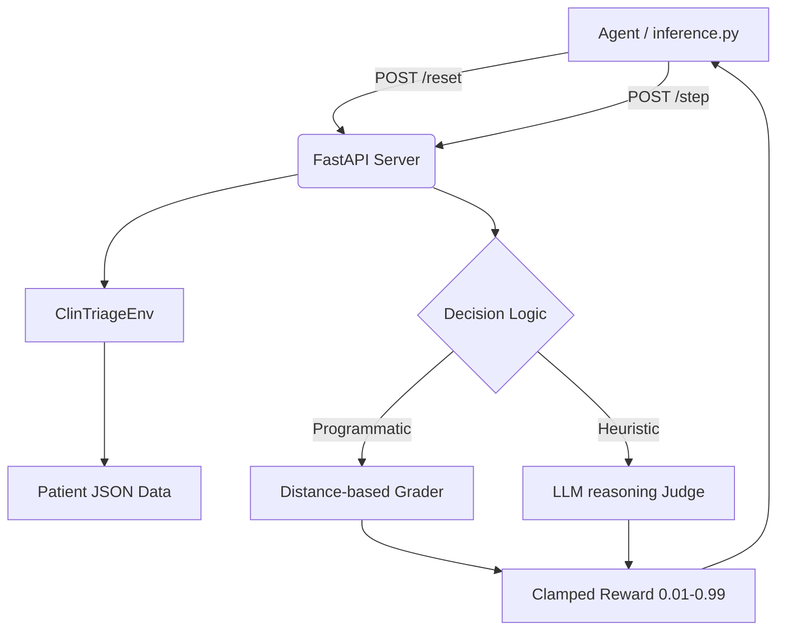

# 🩺 ClinTriageAI - Advanced Clinical RL Environment

[](https://github.com/OpenEnv)
[]()
[]()

**ClinTriageAI** is a state-of-the-art Reinforcement Learning (RL) environment designed to simulate an Indian Emergency Room (ER) triage workflow. It aligns with the **OpenEnv standard**, focusing on high-stakes clinical decision-making, patient prioritization, and ICU resource allocation.

---

## 🚀 Key Features

### 🧠 Multi-Turn Clinical Dialogue
Unlike simple classification tasks, ClinTriageAI supports a conversational loop. Agents can `ask_vitals` to clarify borderline cases, `respond` to nursing staff, or finalize decisions via `triage`.

### 📊 Behavioral Reward Shaping
Our reward system doesn't just grade clinical accuracy; it incentivizes professional conduct:
- **Accuracy (80%)**: Proximity-based scoring for triage levels and ranking.
- **Empathy (10%)**: Rewards for bedside manner and clinical understanding.
- **Decision Efficiency (10%)**: Optimal turn-usage to prevent treatment delays.

### 🏥 4 Progressive Clinical Tasks
1. **Binary Triage**: Direct comparison between two patients (Easy).
2. **Priority Ordering**: Ranking 3 simultaneous patients by risk (Medium).
3. **Multi-Patient Assignment**: assigning Level 1-5 levels to 5 patients (Medium).
4. **ICU Resource Allocation**: complex reasoning for 8 patients and 3 beds (Hard).

---

## 🛠 Architecture



---

## 🚦 Quick Start

### 1. Installation
```bash
uv venv
source .venv/bin/activate
uv pip install -e .
```

### 2. Launch Environment
```bash
python -m server.app
```

### 3. Run Evaluation
```bash
python inference.py
```

---

## 📈 Scoring & RL Signal
ClinTriageAI uses **Dense Reward Shaping** to ensure RL agents converge quickly:
- **Near Misses**: Off by 1 level? Receive a `0.6` partial reward.
- **Lethal Errors**: Misidentifying a Level 1 patient as Level 5? Severe `-0.5` clinical penalty.
- **Persistence**: session-based state management via `pickle` ensures zero data loss during multi-turn episodes.

---

## 🔐 Security & Compliance
- **Safety**: Ground Truth levels are NEVER exposed in the API `Observation`.
- **Validation**: Strict Pydantic models prevent malformed agent actions.
- **Deployment**: Optimized for HuggingFace Spaces and OpenEnv Validator.

---

> [!IMPORTANT]
> **ClinTriageAI** is built for the **OpenEnv Hackathon 2026**. It demonstrates the future of Physician-AI collaboration in high-pressure medical environments.
